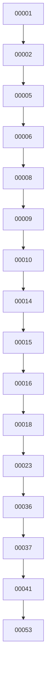

# Análise de Migrações do Banco — ERP Conexão

> **Documento gerado em:** 04/07/2026

---

## 1. Visão Geral

O ERP Conexão possui **~55 migrações SQL** em `supabase/migrations/`, gerenciadas manualmente via `scripts/run-migrations.mjs`.

---

## 2. Organização

- **Migrações numeradas**: `00001_*.sql` a `00053_*.sql` — migrações sequenciais
- **Migrações por data**: `20260512*.sql` — migrações baseadas em timestamp

---

## 3. Linha do Tempo das Migrações

| # | Migração | Tabelas Criadas | Tema |
|---|---|---|---|
| 00001 | `profiles.sql` | `profiles` | Auth + trigger |
| 00002 | `tables.sql` | `cadastros, cadastros_pf, cadastros_pj, atividades` | Core |
| 00005 | `legacy.sql` | `documentos, credenciais` | Documentos |
| 00006 | `admin.sql` | `app_config, mock_credentials, webhooks, webhook_logs` | Admin |
| 00008 | `rls_blindagem.sql` | RLS policies + functions | Segurança |
| 00009 | `endereco_completo.sql` | `cadastros_enderecos` | Endereços |
| 00010 | `permissoes.sql` | `permissoes` + trigger | Permissões |
| 00014 | `notifications.sql` | `notificacoes, notificacoes_templates` | Notificações |
| 00015 | `2fa_rpcs.sql` | RPCs 2FA | Segurança |
| 00016 | `integracoes_nativas.sql` | `integracoes_config` | Integrações |
| 00018 | `form_schema.sql` | `form_schema` | Formulários |
| 00023 | `multiempresas.sql` | `empresas, empresas_config, modulos_empresa` | Multi-tenant |
| 00036 | `nps_module.sql` | `nps_perguntas, nps_respostas, nps_webhook_config, nps_relatorios_envio` | NPS |
| 00037 | `funis_module.sql` | `funis, funis_colunas, funis_tarefas, funis_comentarios, funis_anexos, funis_labels` | Funis |
| 00041 | `hub_module.sql` | `hub_*` (15 tabelas) | Hub |
| 00053 | `empresa_linktree.sql` | `linktree_empresa_*` | LinkTree |

---

## 4. Script de Aplicação

`scripts/run-migrations.mjs`:

```javascript
// Aplica migrações SQL em ordem alfabética
const migrations = fs.readdirSync("supabase/migrations")
  .filter(f => f.endsWith(".sql"))
  .sort();
for (const m of migrations) {
  const sql = fs.readFileSync(`supabase/migrations/${m}`, "utf-8");
  await supabase.rpc("exec_sql", { sql });
}
```

---

## 5. Dependências entre Migrações



---

## 6. Funções/Triggers Criadas

- `handle_new_user()` — Trigger auth.users → profiles
- `get_current_empresa_id()` — Helper RLS
- `is_super_admin_session()` — Helper RLS
- `is_admin_or_super()` — Helper RLS
- `pode_acessar_empresa(uuid)` — Helper RLS
- `get_permissoes_padrao(text)` — Default permissions
- `handle_new_profile_permissoes()` — Trigger profile → permissoes
- `gerar_2fa_pin()` — 2FA generation
- `validar_2fa_pin()` — 2FA validation
- `executar_api_connector_server()` — API execution
- `enviar_whatsapp_evolution()` — WhatsApp via pg_net
- `admin_criar_usuario()` — Admin user creation
- `admin_atualizar_senha()` — Admin password update
- `admin_deletar_usuario()` — Admin user deletion

---

## 7. Views

| View | Migração | security_invoker |
|---|---|---|
| `clientes` | 00023 | ✅ true |

---

## 8. Estratégia de Rollback

Atualmente **não há** sistema de rollback. Migrações são destrutivas:
- `DROP POLICY IF EXISTS`
- `ALTER TABLE ... ADD COLUMN IF NOT EXISTS`
- `CREATE OR REPLACE FUNCTION`

---

## 9. RPCs Utilitárias para Migração

`scripts/run-migrations.mjs` — RPC `exec_sql` (não padrão Supabase)
`scripts/migrate-bubble.mjs` — Migração de dados do Bubble.io
`scripts/seed-consultores.mjs` — Seed de consultores
`scripts/seed-crm.mjs` — Seed de dados CRM
