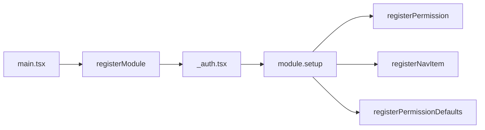

# Análise de Modularidade e Isolamento — ERP Conexão

> **Documento gerado em:** 04/07/2026

---

## ⚠️ REGRA OBRIGATÓRIA: Eventos na Central de Ações

**TODO módulo novo DEVE obrigatoriamente:**

1. **Definir eventos** no `module.ts` (`events: [...]`) com `key`, `label`, `descricao` e `type`
2. **Adicionar `dispararWebhooks()` ou `dispararEventoModulo()`** nos services/rotas para cada evento
3. **Ter aba `eventos`** no módulo (`{ key: "eventos", label: "Eventos", descricao: "..." }`)
4. **Ter um mínimo de 2 eventos** (status_change + button_action) — exceto módulos puramente infraestrutura
5. **Passar `empresa_id`** no payload de todos os eventos

> **Motivo:** A Central de Ações lê automaticamente de `getModule().events`. Se o evento não estiver no `module.ts`, o admin **não consegue** configurar webhooks/notificações/APIs para ele.

### Checklist de criação de módulo

- [ ] `events: [...]` preenchido no `module.ts`
- [ ] Cada evento tem `type: "status_change"` ou `"button_action"`
- [ ] `dispararWebhooks()` ou `dispararEventoModulo()` chamado nos services
- [ ] Aba `eventos` registrada no módulo
- [ ] Build passa (`npm run build`)
- [ ] Verificado que aparece no seletor de módulos da Central de Ações

---

## 1. Visão Geral

O ERP Conexão foi projetado com **arquitetura modular**, onde cada módulo é self-contained em `src/features/<modulo>/`. A única camada de conexão entre módulos é o **banco de dados** (via `empresa_id` multi-tenant).

---

## 2. Estrutura de Módulo

```
src/features/<modulo>/
├── module.ts           → ModuleDefinition + setup()
├── permissions.ts      → ALL_PERMISSIONS
├── types.ts            → Tipos específicos
├── services/           → Supabase queries + hooks
│   ├── <modulo>.service.ts
│   └── <modulo>.queries.ts
├── hooks/              → React Query hooks
├── components/         → Componentes React
└── index.ts            → Exports públicos
```

---

## 3. Registry Pattern

O **Registry** em `src/registry/` é o ponto central de registro:

| Registry | Função |
|---|---|
| `registerModule()` | Registra definição do módulo |
| `registerPermission()` | Registra permissão |
| `registerPermissionDefaults()` | Defaults por ambiente |
| `registerNavItem()` | Item de navegação |
| `registerActionExecutor()` | Executor de ação |

---

## 4. Matriz de Acoplamento

### Módulos de Negócio

| Módulo | Depende de | É dependido por |
|---|---|---|
| Cadastros | Core | — |
| CRM | Core | — |
| NPS | Core | — |
| Mapas | Core | — |
| Funis | Core | — |
| Despesas | Core | — |
| Rotas | Core | — |
| LinkTree | Core | — |
| Gerador Links | Core | — |
| Hub | Core | — |
| Marketing | Core | — |

**Nenhum módulo de negócio depende de outro módulo de negócio.**

### Módulos de Infraestrutura

| Módulo | Depende de |
|---|---|
| Empresa/Core | Core (auth, supabase) |
| Global | Core + Todos módulos (admin) |

---

## 5. Script de Verificação

`scripts/check-isolation.sh`:

```bash
#!/bin/bash
# Verifica se há imports entre features/
# Exemplo: grep -r "from \"~/features/nps" src/features/cadastros/
```

---

## 6. Shared vs Feature

### Core/Shared

| Pasta | Conteúdo |
|---|---|
| `src/core/auth/` | AuthProvider + types |
| `src/core/permissions/` | Permissions constants + services |
| `src/core/services/` | Webhooks, notificações, atividades |
| `src/core/supabase/` | Supabase client |
| `src/core/empresa/` | EmpresaContext |
| `src/core/theme/` | ThemeProvider |
| `src/core/router/` | AuthGuard |
| `src/design-system/` | Tokens, provider, ModuloDesignPage |
| `src/registry/` | Module, permission, nav, executor registries |

### Feature

| Pasta | Módulos |
|---|---|
| `src/features/cadastros/` | Módulo Cadastros |
| `src/features/crm/` | Módulo CRM |
| `src/features/hub/` | Módulo Hub |
| ... | ... |

---

## 7. Ciclo de Vida do Módulo

### Inicialização



---

## 8. Regras de Isolamento

1. **Módulo não importa outro módulo** — apenas `~/registry`, `~/core/*`, `~/components/ui/*`
2. **Compartilhamento via banco** — módulos se comunicam apenas via Supabase
3. **Registry é o barramento** — módulos registram, não importam
4. **Empresa_id** — toda tabela tem `empresa_id` para isolamento multi-tenant
5. **NavItems por módulo** — cada módulo registra seus próprios itens de navegação
