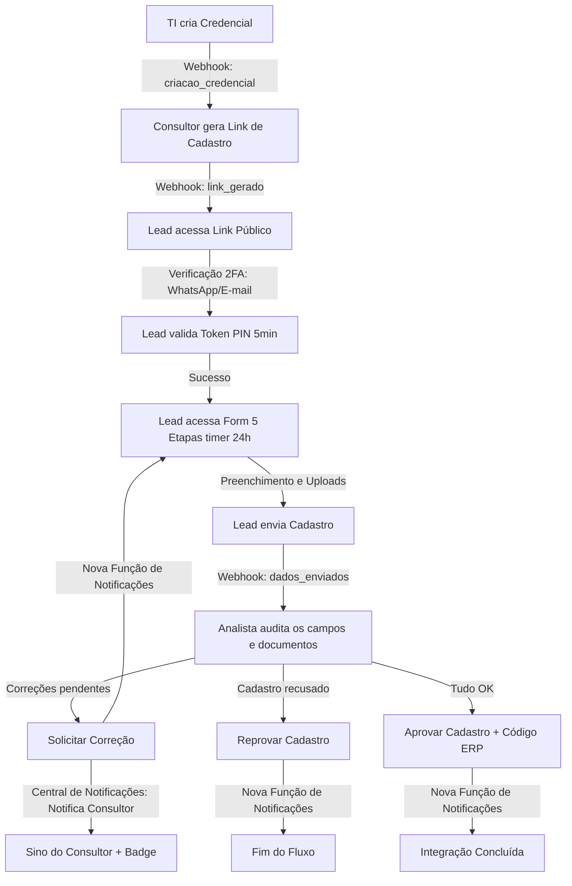

# Especificação do Fluxo de Cadastro - Conexão Implantes

Este documento descreve de ponta a ponta o funcionamento técnico do sistema de cadastros, mapeando a jornada das credenciais, a geração de links, o preenchimento por parte do cliente final, a análise pela equipe de cadastro, a central de notificações e os disparos de webhooks/atividades.

---

## Personagens do Fluxo

1. **Administrador de TI / Suporte**: Responsável pela criação de acessos e parametrizações gerais.
2. **Consultor de Vendas (Comercial)**: Aquele que capta o lead e inicia a solicitação de cadastro/atualização.
3. **Lead / Cliente Final**: O dentista ou clínica que realiza o preenchimento de seus dados e anexa a documentação.
4. **Analista de Cadastro (Backoffice)**: O auditor interno responsável por validar cada campo/documento e efetivar a integração com o ERP Protheus.
5. **Super Admin**: Usuário com permissões totais, responsável por gerenciar credenciais, configurações e personalizar notificações do sistema.

---

## Mermaid Diagram: Visão Geral do Fluxo

---

## Storytelling do Fluxo: Da Credencial ao Fim da Jornada

### 1. O Início: A Geração de Credenciais e Acessos

Toda a jornada começa com a liberação de acesso. Um **Administrador** (com permissão `gerenciar_credenciais_admin`) acessa a tela de gerenciamento de credenciais.

- **Onde ocorre**: Rota `/credenciais` ([credenciais.tsx](file:///c:/Users/trcnologia/Desktop/bubble_reverse_engineering/cadastros-conexao/src/routes/credenciais.tsx)).
- **Funcionamento**:
  1. O administrador clica em **Nova** e preenche: _Nome Completo, E-mail Corporativo, WhatsApp Corporativo e Departamento_.
  2. Ao submeter o formulário, o frontend invoca a função `criarCredencial(form)` ([credenciais.ts](file:///c:/Users/trcnologia/Desktop/bubble_reverse_engineering/cadastros-conexao/src/lib/credenciais.ts#L30)).
  3. **Logs e Webhooks**: O sistema dispara um **webhook de submissão do formulário de credenciais** para notificar sistemas externos.
  4. Os dados são gravados na tabela `credenciais` do banco de dados PostgreSQL (via Supabase).
  5. O usuário é convidado a criar sua conta via autenticação padrão do Supabase. No momento em que ele se registra (`signUp`), a função `register()` ([auth.tsx](file:///c:/Users/trcnologia/Desktop/bubble_reverse_engineering/cadastros-conexao/src/lib/auth.tsx#L94)) cria um registro respectivo na tabela `profiles`.
  6. A tabela `permissoes` define o que este usuário poderá operar no sistema (ex: consultores só geram links, analistas de cadastro auditam dados).

---

### 2. A Captura: Geração do Link de Cadastro

Um **Consultor de Vendas**, após negociar com um cliente (Lead), necessita que este envie a ficha cadastral para faturamento de compras.

- **Onde ocorre**: Rota `/consultor` ([consultor.tsx](file:///c:/Users/trcnologia/Desktop/bubble_reverse_engineering/cadastros-conexao/src/routes/consultor.tsx)).
- **Funcionamento**:
  1. O consultor clica em **Solicitar Cadastro** (ou **Atualizar Cadastro** se for um cliente existente).
  2. Ele define a forma de compartilhamento (WhatsApp ou E-mail), prazo de expiração do link (1, 3, 5 ou 7 dias), nome do lead, e e-mail/WhatsApp de destino.
  3. Ao clicar em **Compartilhar Link**, o sistema executa a função `criarCadastro()` ([clientes.ts](file:///c:/Users/trcnologia/Desktop/bubble_reverse_engineering/cadastros-conexao/src/lib/clientes.ts#L96)):
     - Gera um token UUID público exclusivo (`token_acesso`).
     - Insere um novo registro na tabela `cadastros` com status inicial `link_gerado` e a data de expiração calculada.
  4. **Regras de Expiração e Validade**:
     - O token possui um prazo rígido de validade de acesso definido pelo consultor. Caso o prazo se esgote sem que o cadastro seja concluído, o link torna-se **inacessível**.
     - É feita a captura desse estado: se o link foi acessado ou não, e se está expirado ou não.
     - Se o link expirar sem acesso, o registro é **deletado automaticamente do banco de dados**, obrigando o consultor a gerar um link totalmente novo.
  5. **Logs e Webhooks disparados**:
     - Cria log na tabela de auditoria: `logAtividade("cadastro", id, "link_gerado", ...)`
     - Dispara webhook: `dispararWebhooks("botao_compartilhar_link", payload)`
     - Dispara webhook: `dispararWebhooks("link_gerado", payload)`
  6. O consultor compartilha a URL gerada: `https://[dominio]/pre-cadastro/[token_acesso]`.

---

### 3. A Ficha: O Preenchimento pelo Cliente Final (Lead)

O **Cliente Final** recebe a mensagem contendo o link único e seguro de pré-cadastro.

- **Onde ocorre**: Rota pública `/pre-cadastro/$token` ([pre-cadastro.$token.tsx](file:///c:/Users/trcnologia/Desktop/bubble_reverse_engineering/cadastros-conexao/src/routes/pre-cadastro.$token.tsx)).
- **Funcionamento**:
  1. **Verificação de 2 Fatores (Antes do Formulário)**:
     - Ao acessar a URL pública, a primeira tela obriga o Lead a passar por uma verificação de 2 fatores.
     - O Lead escolhe o canal por onde quer receber o código de validação: **E-mail** ou **WhatsApp** (digitando seu número com DDI + DDD + número).
     - O sistema envia um token PIN numérico com validade máxima de **5 minutos**.
     - Caso o Lead falhe em inserir e validar o token de 6 dígitos dentro desse prazo de 5 minutos, o token expira, sendo necessário gerar um novo PIN. Esse processo pode ser repetido livremente, desde que o prazo de validade geral do link de cadastro ainda seja válido.
  2. **O Formulário de 5 Etapas com Timer**:
     - Uma vez validada a etapa de segurança (2FA), o Lead é direcionado ao assistente do formulário de 5 etapas para preenchimento.
     - O tempo limite para completar o preenchimento dos dados e documentos nesta etapa é de **24 horas**.
     - Durante o preenchimento, um **timer regressivo** é exibido no topo da tela do frontend informando o tempo restante.
     - Caso as 24 horas passem sem o envio completo, o link é sumariamente bloqueado e um **modal explicativo** informa o ocorrido ao Lead, orientando-o a entrar em contato com o consultor comercial para gerar um novo acesso.
     - _As 5 Etapas são_:
       1. **Tipo de Cadastro**: Pessoa Física (PF) ou Pessoa Jurídica (PJ).
       2. **Dados cadastrais**: Campos obrigatórios (CPF/CNPJ, CRO/TPD, e-mails de comunicação e NFe, telefones).
       3. **Endereço**: Autocompleta via CEP com suporte do ViaCEP.
       4. **Documentos**: Upload de arquivos (.jpeg, .jpg, .png, .pdf) armazenados no bucket privado do Supabase.
       5. **Finalização**: Validação e salvamento final.
     - _Webhooks_: Dispara o webhook `dados_enviados` e o webhook `em_analise` ao finalizar e enviar todo o conjunto de dados.

---

### 4. O Crivo: Análise e Auditoria pela Equipe de Cadastro

Uma vez que o lead preencheu e enviou a documentação, o cadastro entra no painel de pendências internas sob o status `em_analise`.

- **Onde ocorre**: Rota `/clientes/$id` ([clientes.$id.tsx](file:///c:/Users/trcnologia/Desktop/bubble_reverse_engineering/cadastros-conexao/src/routes/clientes.$id.tsx)).
- **Funcionamento**:
  1. O analista de cadastro visualiza os dados divididos em três colunas organizadas: _Dados do Cliente_, _Endereço_ e _Documentos_.
  2. Cada campo possui um controle individual (`CampoRevisavel`). O analista pode auditar campo por campo e documento por documento:
     - **Aprovar (OK)**: Marca o status do campo/documento como `ok`.
     - **Reprovar**: Marca como `reprovado` e insere o motivo específico.
     - **Solicitar Correção**: Marca como `em_correcao` e descreve o que precisa ser ajustado.
  3. O analista dispõe de **Botões de Ação em Massa** (badges compactos de ícones CheckCircle, XCircle, AlertTriangle e RotateCcw) para alterar o status de todos os campos de uma seção de forma rápida.
  4. Cada alteração individual de status nos dados insere registros na tabela `revisoes` ou atualiza a tabela `documentos` e gera logs de auditoria (`logAtividade`).

---

### 5. O Desfecho: Os Três Destinos do Cadastro

A análise culmina em uma das três grandes decisões tomadas pela equipe de cadastro:

#### A. Solicitação de Correção (Cadastro com pendências)

Se houverem campos ou documentos reprovados/em correção, o analista clica em **Corrigir**.

1. O sistema concatena de forma automatizada todas as pendências anotadas em um único resumo textual descritivo.
2. O analista clica em "Solicitar".
3. A função `solicitarCorrecao()` ([clientes.ts](file:///c:/Users/trcnologia/Desktop/bubble_reverse_engineering/cadastros-conexao/src/lib/clientes.ts#L140)) altera o status do cadastro principal para `em_correcao`.
4. **Logs, Webhooks, Notificações e Central de Notificações**:
   - Registra a atividade: `logAtividade("cadastro", id, "correcao", motivo)`
   - Dispara webhook: `dispararWebhooks("botao_corrigir", payload)`
   - Dispara webhook: `dispararWebhooks("em_correcao", payload)`
   - Executa a **NOVA FUNÇÃO DE NOTIFICAÇÕES** para avisar o lead (via E-mail/WhatsApp).
   - Gera uma **Notificação Interna** para o consultor comercial responsável, informando que o cadastro necessita de correções (caindo na Central de Notificações).
5. O link original de pré-cadastro volta a ficar disponível para o cliente final. Ao acessá-lo, o cliente visualiza apenas os campos destacados com erro e a justificativa do auditor para que realize as correções.

#### B. Reprovação Definitiva

Caso o cadastro possua impedimentos graves ou documentação incompatível intransponível, o analista clica em **Reprovar**.

1. O analista justifica a reprovação definitiva.
2. A função `reprovarCadastro()` ([clientes.ts](file:///c:/Users/trcnologia/Desktop/bubble_reverse_engineering/cadastros-conexao/src/lib/clientes.ts#L132)) altera o status para `reprovado` e salva a justificativa e data de finalização.
3. **Logs, Webhooks, Notificações e Central de Notificações**:
   - Registra a atividade: `logAtividade("cadastro", id, "reprovado", motivo)`
   - Dispara webhook: `dispararWebhooks("botao_reprovar", payload)`
   - Dispara webhook: `dispararWebhooks("reprovado", payload)`
   - Executa a **NOVA FUNÇÃO DE NOTIFICAÇÕES** para disparar avisos de recusa definitiva para o lead.
   - Gera uma **Notificação Interna** na Central de Notificações para o consultor comercial responsável, alertando-o da reprovação definitiva do cadastro.
4. O link expira permanentemente e o processo é finalizado como recusado.

#### C. Aprovação e Integração ERP Protheus

Se todas as revisões individuais de dados e de documentos estiverem marcadas como `ok`, a opção de aprovação é desbloqueada no painel.

1. O analista clica em **Aprovar** e digita o **Código do Cliente** gerado no ERP Protheus.
2. A função `aprovarCadastro()` ([clientes.ts](file:///c:/Users/trcnologia/Desktop/bubble_reverse_engineering/cadastros-conexao/src/lib/clientes.ts#L123)) altera o status para `aprovado`, salva o código do cliente Protheus (`codigo_cliente`) e preenche a data final.
3. **Logs, Webhooks, Notificações e Central de Notificações**:
   - Registra a atividade: `logAtividade("cadastro", id, "aprovado", ...)`
   - Dispara webhook: `dispararWebhooks("botao_aprovar", payload)`
   - Dispara webhook: `dispararWebhooks("aprovado", payload)`
   - Executa a **NOVA FUNÇÃO DE NOTIFICAÇÕES** para parabenizar o cliente.
   - Gera uma **Notificação Interna** de aprovação de cadastro na Central de Notificações para o consultor comercial comemorar a ativação do cliente no sistema ERP.
4. A integração com sistemas integradores externos (ERP) recebe o payload completo com dados de PF/PJ, endereço e links de documentos validados para completar a sincronização. O cadastro é finalizado como ativo.

---

### 6. A Central de Notificações Internas (Notificações em Tempo Real)

Esta funcionalidade visa centralizar, organizar e gerenciar a comunicação interna do sistema em tempo real sobre todas as ações e eventos cruciais.

- **Customização pelo Super Admin**:
  - O **Super Admin** do sistema possui acesso a um módulo de configurações onde pode habilitar, desabilitar e personalizar inteiramente a redação, título e canais de notificação para cada evento específico da aplicação (ex: nova credencial, correção solicitada, cadastro reprovado ou finalizado).
- **UX/UI na Aplicação**:
  - **Sino de Notificações**: No cabeçalho global da aplicação, é exibido o ícone de um **sino**.
  - **Contador/Badge**: Um badge com número em destaque exibe a quantidade exata de notificações pendentes (não visualizadas) para o usuário que está logado no momento.
  - **Resumo e Leitura**: Ao clicar no sino, abre-se um resumo suspenso (painel drop-down ou popover) com as notificações mais recentes. O usuário pode clicar sobre a mensagem de notificação para ler a informação detalhada e ser direcionado diretamente à ação ou tela do cadastro envolvido.
  - **Marcação de Leitura**: Assim que visualizadas no resumo ou individualmente pelo usuário, o sistema altera o status da notificação para **Lida** (`lida = true`), reduzindo dinamicamente o número no badge do sino.

---

### 7. Diretrizes de Webhooks e Personalização de Botões de Ação

- **Regra de Ouro da Arquitetura**: Sempre que um novo botão de ação ou fluxo interativo for implementado na aplicação, o desenvolvedor deve obrigatoriamente associá-lo a um evento correspondente no motor de webhooks (registrando-o nas listas `EVENTOS_BUTTON_ACTION` ou `EVENTOS_STATUS_CHANGE`).
- **Funcionamento e Customização**:
  - Todos os botões que executam ações no banco ou disparam integrações externas são 100% personalizáveis.
  - O **Super Admin** tem o poder de associar URLs específicas, métodos HTTP (POST, GET, PUT) e payloads customizados para cada ação disparada por botão no painel de controle. Dessa forma, nenhuma ação crítica fica restrita a rotinas internas rígidas, permitindo integração direta com qualquer ERP, CRM ou ferramenta de automação externa.
