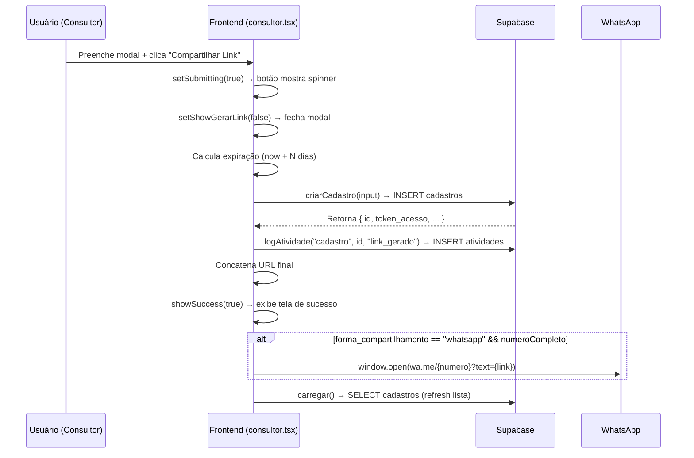

# Workflow: Botão "Compartilhar Link"

**Arquivo:** `src/routes/consultor.tsx:184-185`
**Função handler:** `gerarLink()` (linhas 63-86)

---

## Visão Geral do Fluxo



---

## 1. Dados Enviados no Modal

**Coletados do formulário antes do clique:**

| Campo            | Origem                                             | Exemplo                |
| ---------------- | -------------------------------------------------- | ---------------------- |
| `tipo_acao`      | Botões "Solicitar Cadastro" / "Atualizar Cadastro" | `"solicitar_cadastro"` |
| `receber_por`    | Botão WhatsApp / E-mail                            | `"whatsapp"`           |
| `nome_lead`      | Input texto                                        | `"João Silva"`         |
| `email_lead`     | Input email (se forma=email)                       | `"joao@email.com"`     |
| `ddi`            | Select país                                        | `"55"`                 |
| `ddd`            | Input                                              | `"11"`                 |
| `whatsapp_num`   | Input                                              | `"912345678"`          |
| `expiracao_dias` | Select                                             | `"5"`                  |

---

## 2. CRUD CREATE: `criarCadastro()`

**Arquivo:** `src/lib/clientes.ts:91-105`

### Operação

`INSERT` na tabela `public.cadastros` via cliente JS do Supabase.

### Campos Inseridos

| Campo                    | Valor                                        |
| ------------------------ | -------------------------------------------- |
| `id`                     | Gerado automaticamente (`gen_random_uuid()`) |
| `token_acesso`           | `crypto.randomUUID()` (UUID v4)              |
| `status`                 | `"link_gerado"`                              |
| `data_criacao_link`      | `new Date().toISOString()`                   |
| `tipo_acao`              | `linkForm.tipo_acao`                         |
| `forma_compartilhamento` | `linkForm.receber_por`                       |
| `lead_nome`              | `linkForm.nome_lead` (ou `null`)             |
| `lead_email`             | `linkForm.email_lead` (ou `null`)            |
| `lead_whatsapp`          | `numeroCompleto` (ou `null`)                 |
| `link_expiracao`         | `new Date(now + N dias).toISOString()`       |
| `created_by`             | `user.id` (contexto de autenticação)         |
| `created_at`             | Default `now()`                              |
| `updated_at`             | Default `now()`                              |

### Schema da Tabela

```sql
create table public.cadastros (
  id              uuid primary key default gen_random_uuid(),
  codigo_cliente  text,
  tipo_pessoa     text check (tipo_pessoa in ('PF','PJ')),
  status          text not null default 'link_gerado'
                    check (status in ('link_gerado','dados_enviados','em_analise','em_correcao','aprovado','reprovado')),
  token_acesso    text unique,
  nome_temporario text,
  tipo_acao       text default 'solicitar_cadastro'
                    check (tipo_acao in ('solicitar_cadastro', 'atualizar_cadastro')),
  forma_compartilhamento text check (forma_compartilhamento in ('whatsapp', 'email', 'copiar')),
  link_expiracao  timestamptz,
  data_criacao_link timestamptz,
  data_finalizacao timestamptz,
  comentario_reprovacao text,
  revisado        boolean default false,
  consulta_cnpj_realizada boolean default false,
  consulta_cro_realizada boolean default false,
  status_verificacao_token boolean default false,
  token_gerado    text,
  token_expiracao timestamptz,
  email_token     text,
  lead_email      text,
  lead_whatsapp   text,
  lead_nome       text,
  data_consulta   timestamptz,
  colaborador     text,
  observacoes     text default '',
  created_by      uuid references public.profiles(id),
  created_at      timestamptz default now(),
  updated_at      timestamptz default now()
);
```

### Retorno

Objeto `Cadastro` completo (incluindo `id` e `token_acesso` gerados).

---

## 3. CRUD CREATE: `logAtividade()`

**Arquivo:** `src/lib/atividades.ts:14-31`

### Operação

`INSERT` na tabela `public.atividades`.

### Campos Inseridos

| Campo           | Valor                                                           |
| --------------- | --------------------------------------------------------------- |
| `entidade_tipo` | `"cadastro"`                                                    |
| `entidade_id`   | `id` do cadastro recém-criado                                   |
| `acao`          | `"link_gerado"`                                                 |
| `descricao`     | Template string: `` `Link gerado para ${linkForm.nome_lead}` `` |
| `usuario_id`    | `user.id` obtido via `supabase.auth.getUser()`                  |
| `created_at`    | Default `now()`                                                 |

### Schema da Tabela

```sql
create table public.atividades (
  id              uuid primary key default gen_random_uuid(),
  entidade_tipo   text not null check (entidade_tipo in ('cadastro')),
  entidade_id     uuid not null,
  acao            text not null,
  descricao       text default '',
  usuario_id      uuid references public.profiles(id),
  created_at      timestamptz default now()
);
```

---

## 4. Side Effect: Construção do Link

**Arquivo:** `src/routes/consultor.tsx:77`

```
link = window.location.origin + "/pre-cadastro/" + s.token_acesso
```

Exemplo: `https://app.conexaoimplantes.com.br/pre-cadastro/550e8400-e29b-41d4-a716-446655440000`

---

## 5. Side Effect: Abertura do WhatsApp

**Arquivo:** `src/routes/consultor.tsx:81-83`

**Condição:** `receber_por === "whatsapp"` e `numeroCompleto` tem valor.

```
window.open(
  "https://wa.me/" + numeroCompleto.replace(/\D/g, "") +
  "?text=" + encodeURIComponent("Olá! Acesse o link para seu cadastro: {link}"),
  "_blank"
)
```

---

## 6. CRUD READ: Refresh da Lista (`carregar()`)

**Arquivo:** `src/routes/consultor.tsx:52-59`

### Operação

`SELECT` na tabela `public.cadastros` filtrado por `created_by = user.id`, com join em `profiles`.

### Query

```typescript
supabase
  .from("cadastros")
  .select("*, profiles!created_by(nome)")
  .eq("created_by", user.id)
  .order("created_at", { ascending: false });
```

---

## 7. Workflow Futuro: Cliente Acessa o Link

**Rota:** `/pre-cadastro/$token` → `src/routes/pre-cadastro.$token.tsx`

| Etapa                            | Ação                                                         | Operação no Banco                                                                                                              |
| -------------------------------- | ------------------------------------------------------------ | ------------------------------------------------------------------------------------------------------------------------------ |
| **7.1** Cliente acessa URL       | `validarToken()` chamado no `useEffect`                      | RPC `get_cadastro_by_token(token_text text)` → `SELECT` em `cadastros` (security definer, bypass RLS)                          |
| **7.2** Verificação de expiração | Compara `link_expiracao < now()`                             | Lado cliente                                                                                                                   |
| **7.3** Cliente preenche dados   | Formulário multi-step (tipo → dados → endereço → documentos) | Lado cliente                                                                                                                   |
| **7.4** Envio dos dados          | `handleSubmit()` → `update_cadastro_from_precadastro()` RPC  | `UPDATE cadastros` (status→`dados_enviados`) + `INSERT` / `ON CONFLICT` em `cadastros_pf`/`cadastros_pj`/`cadastros_enderecos` |
| **7.5** Upload de documentos     | `uploadDocumento()`                                          | Storage bucket `documentos` + `INSERT` tabela `documentos`                                                                     |
| **7.6** 2FA - Envio do token     | `handleEnviarToken()`                                        | `UPDATE cadastros` (token_gerado, status→`em_analise`)                                                                         |
| **7.7** 2FA - Validação          | `handleValidarToken()`                                       | `SELECT` + `UPDATE cadastros` (status_verificacao_token→true)                                                                  |

---

## 8. Único Trigger no Banco de Dados

**Arquivo:** `supabase/migrations/00001_profiles.sql:29-50`

```sql
create or replace function public.handle_new_user()
returns trigger
language plpgsql
security definer
set search_path = ''
as $$
begin
  insert into public.profiles (id, email, nome, role)
  values (new.id, new.email, coalesce(new.raw_user_meta_data ->> 'nome', ''), 'viewer');
  return new;
end;
$$;

create or replace trigger on_auth_user_created
  after insert on auth.users
  for each row
  execute function public.handle_new_user();
```

> ⚠️ **Nota:** Não há **edge functions**, **webhooks**, ou `pg_net` configurados neste projeto. Todo o fluxo é síncrono via cliente Supabase JS.

---

## Resumo Consolidado

| #   | Workflow             | Tipo                    | Tabela / Serviço                              | Gatilho               |
| --- | -------------------- | ----------------------- | --------------------------------------------- | --------------------- |
| 1   | Criar cadastro       | **CREATE**              | `cadastros`                                   | Clique no botão       |
| 2   | Logar atividade      | **CREATE**              | `atividades`                                  | Após criar cadastro   |
| 3   | Construir URL        | **Lógica**              | N/A                                           | Imediato              |
| 4   | Abrir WhatsApp       | **Side Effect**         | `wa.me` (nova aba)                            | Se forma=whatsapp     |
| 5   | Refresh lista        | **READ**                | `cadastros`                                   | Após criar            |
| 6   | Cliente valida token | **RPC READ**            | `get_cadastro_by_token()`                     | Acesso ao link        |
| 7   | Cliente envia dados  | **RPC UPDATE + INSERT** | `cadastros` + `cadastros_pf`/`pj`/`enderecos` | Submissão do form     |
| 8   | Cliente envia docs   | **Storage + CREATE**    | bucket `documentos` + tabela `documentos`     | Upload de arquivo     |
| 9   | 2FA                  | **UPDATE**              | `cadastros`                                   | Solicitação/validação |

---

## Diagrama de Estados do Cadastro

```
link_gerado ──→ dados_enviados ──→ em_analise ──→ aprovado
                                        │              │
                                        ├── em_correcao │
                                        │              │
                                        └──→ reprovado
```

- `link_gerado` → setado no momento da criação do link (botão "Compartilhar Link")
- `dados_enviados` → setado quando o cliente submete o formulário de pré-cadastro
- `em_analise` → setado no 2FA (envio do token de verificação)
- `aprovado` / `reprovado` / `em_correcao` → setado manualmente pelo admin/consultor
